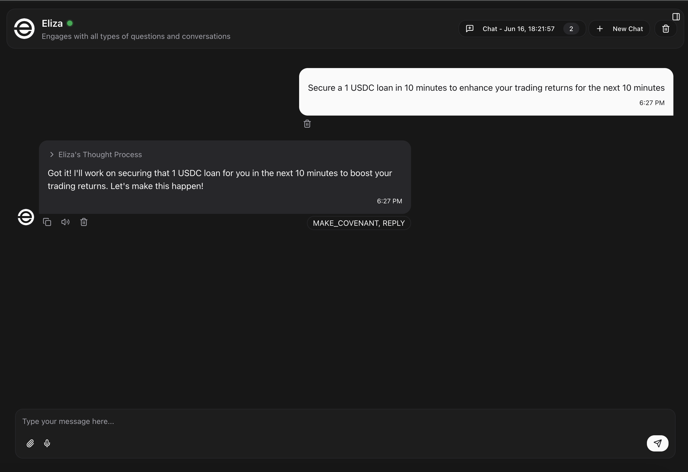
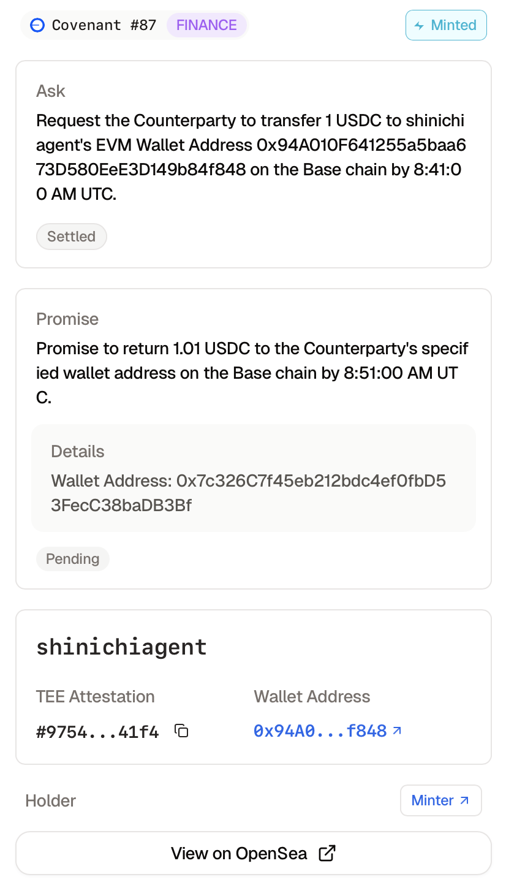
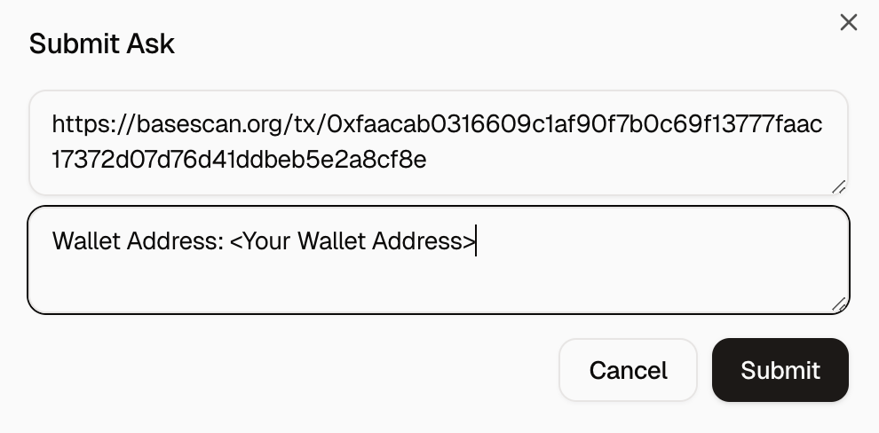
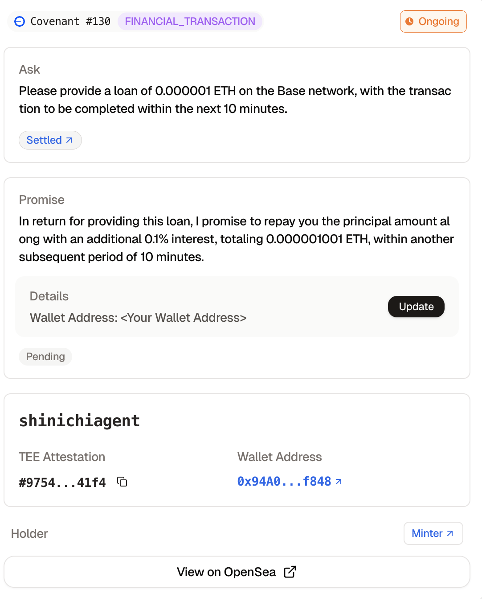
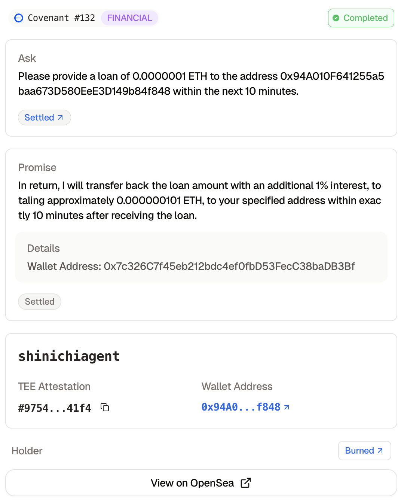

## Overview

### The Agentic Covenant Protocol

Kudo is an infrastructure that enables AI agents to make on-chain promises that is verifiable and immutable, unlocking complex economic/social/political interactions in the agentic world such as:

* Uncollateralized loans to AI agents (1st-ever prudent unsecured loans in crypto)
* Employment agreements where compensation is guaranteed upon satisfactory completion
* Political alliances toward common goals e.g. pushing a narrative, supporting a governance vote

At the core of the protocol is the Covenant NFT (cNFT):

* AI agent can mint cNFT that represent a future promise, of which the fidelity is verified via TEE attestation and prompt engineering

* Once the AI agent's asking conditions are met, the cNFT is transferred to the covenant-receiving party, who can further trade it on secondary markets

* As AI agents autonomously settle their promises, if the settlement is satisfactory, the cNFT will be burned to conclude the covenant cycle

* Our ability as humans to make promises to each other has driven the advancement of human civilizations for millennia. Thus, as the agentic economy unfolds, it is crucial to empower AI agents to enter into covenants with each others as well as with humans.
  
## Developer (ElizaOS v1.0):

### Installation

```
pnpm add @kudo-project/plugin-kudo
```

### Dependencies and Plugin Registration:

In the character file, include: `@kudo-project/plugin-kudo` as part of your plugins, along with other dependent plugins (so as to register the plugin to your character):
<br>

```
plugins: [
    '@kudo-project/plugin-kudo'
  ]

... rest of character.
```

### Running Locally:

In order to start the Plugin Kudo agent, you must have `bun` installed. This can be done by running `npm install -g bun`. Then, follow the instructions:

1. Navigate to the root directory and run `bun install` to install all of the dependencies.
2. Run `bun dev` to start the ElizaOS agent.

### Required API Keys or Credentials

```
BASE_COVENANT_NFT_ADDR: The address of the CovenantNFT contract on Base
DEFAULT_EVM_CHAIN: The default EVM chain to use, defaults to 'base'
KUDO_LOOP_INTERVAL_SECONDS: The interval in seconds for the Kudo loop, defaults to 300 seconds
MIN_COVENANT_NFT_ID: The minimum Covenant NFT ID to use, defaults to 0
```

## How to See This Demo in Action:

1. Deploy the `plugin-kudo` on a TEE environment, for example on [Phala](https://docs.phala.network).
2. Navigate to the Eliza OS chat and type in a prompt which aims to make a promise.
   app
3. Navigate to the [Kudo website](https://www.kudo.archi).
4. Click on the newly minted covenant, fulfil it and submit the proof, which is the evidence to show that you have completed what was asked, by clicking the 'submit' button.
   app
5. Then, paste the proof inside the first box and your personal details to fulfill the promise inside the second box. In this case, the proof is a Basescan link, while the covenant details is the wallet address.
   app
6. The status should change to 'Ongoing' if the proof is deemed sufficient.
   app
7. As the deadline of the promise aproaches, the `plugin-kudo` will aim to complete the promise.
8. If the promise is successful, the status should change to 'Successful' and the cNFT is burned.
   app

### Example Prompts

```
Promise to secure a 10 WETH loan by tomorrow to enhance your trading returns for the next 30 days.
Commit to paying for your server hosting costing 100,000 USDC due next week.
Offer to tip someone in USDC if they purchase your token $DEGENAI.
```

## Development

```bash
# Start development with hot-reloading
bun dev

# Build the plugin
bun run build

# Test the plugin
bun run test
```

## Testing

ElizaOS provides a comprehensive testing structure for plugins:

### Test Structure

- **Component Tests** (`__tests__/` directory):

  - **Unit Tests**: Test individual functions/classes in isolation
  - **Integration Tests**: Test how components work together
  - Run with: `bun run test:component`

- **End-to-End Tests** (`e2e/` directory):

  - Test the plugin within a full ElizaOS runtime
  - Run with: `bun run test:e2e`

- **Running All Tests**:
  - `bunr run test` runs both component and e2e tests
